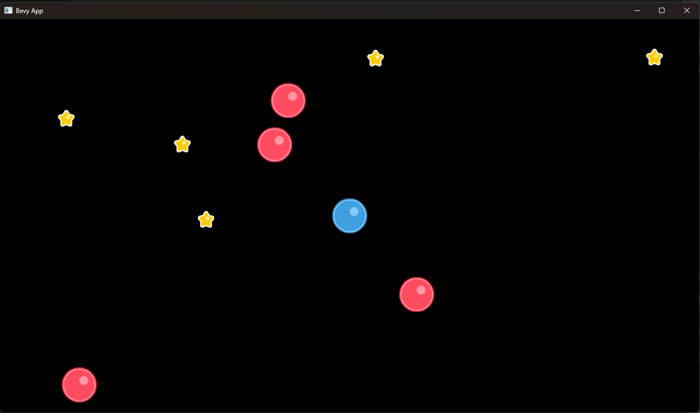

# I'm learning to do gamedev in rust

### This is my progress on following [this tutorial](https://www.youtube.com/playlist?list=PLVnntJRoP85JHGX7rGDu6LaF3fmDDbqyd)

Right now it looks like this. You can build it with `cargo run` or download exe in releases

